

  <!-- ==================== HERO HEADER: DEVELOPER WORKSTATION ==================== -->
  

    

  <!-- DYNAMIC TYPING SVG BANNER -->
  

    

  <!-- METRIC BADGES -->
  

    
    
    
    
  

<!-- ==================== TOP RUNNER: DEVELOPER MOVING LEFT TO RIGHT ==================== -->

  

---

## 👨‍💻 Workstation & System Telemetry

  

---

## 👨‍💻 About Me & Engineering Focus

<pre><code>aryan = {
    "name":     "Aryan Anand",
    "location": "India 🇮🇳",
    "role":     "Software & Cloud Engineer",
    "learning": ["Cloud Computing", "DevOps", "Linux"],
    "skills":   ["Python", "ML", "Data Analytics", "Web Dev", "Java", "C++"],
    "reach_me": "anandaryan406@gmail.com",
    "fun_fact": "I am a Learner 🧑‍💻"
}</code></pre>

- 🌱 Currently exploring **Cloud Computing · DevOps · Linux**
- 🔭 All my projects → **[github.com/AryanAnand-25raj](https://github.com/AryanAnand-25raj)**
- 💬 Ask me about **Python · ML · Data Analytics · Web Development · jQuery · JavaScript**
- 📝 Personal: **[Instagram @anand_aryan_25](https://www.instagram.com/anand_aryan_25/)** • Tech Blog: **[@aryan_coder25](https://www.instagram.com/aryan_coder25)**
- 🔷 Learning **Java & DSA** for day-to-day problem solving
- 📫 Reach me at **[anandaryan406@gmail.com](mailto:anandaryan406@gmail.com)**
- ⚡ Fun fact: **I am a Learner 🧑‍💻**

<!-- ==================== TRACK DIVIDER 01: GIT FLOW PIPELINE ==================== -->

  

---

## 🚀 Featured Projects & Architecture

<table>
  <tr>
    <td width="50%" valign="top">
      <h3 align="center">☁️ Cloud-Native Microservices Engine</h3>
      

        
        
        
        
      

      
High-availability distributed microservices backend with automated CI/CD deployment pipelines, container orchestration, and serverless compute integration.

      

        <a href="https://github.com/AryanAnand-25raj?tab=repositories"><b>📂 View Repositories →</b></a>
      

    </td>
    <td width="50%" valign="top">
      <h3 align="center">🤖 AI Vision & Predictive Analytics</h3>
      

        
        
        
        
      

      
Real-time computer vision system & predictive machine learning pipeline for automated pattern recognition, dataset classification, and intelligence telemetry.

      

        <a href="https://github.com/AryanAnand-25raj?tab=repositories"><b>📂 View Repositories →</b></a>
      

    </td>
  </tr>
  <tr>
    <td width="50%" valign="top">
      <h3 align="center">🌐 Full-Stack Distributed Platform</h3>
      

        
        
        
        
      

      
Modern responsive cloud web application featuring secure JWT authentication, RESTful APIs, real-time WebSocket state management, and cloud storage.

      

        <a href="https://github.com/AryanAnand-25raj?tab=repositories"><b>📂 View Repositories →</b></a>
      

    </td>
    <td width="50%" valign="top">
      <h3 align="center">🔷 DSA Problem Solving Vault</h3>
      

        
        
        
        
      

      
Comprehensive algorithmic archive containing optimized solutions for graphs, dynamic programming, trees, and system design challenges.

      

        <a href="https://github.com/AryanAnand-25raj?tab=repositories"><b>📂 View Repositories →</b></a>
      

    </td>
  </tr>
</table>

---

## 🛠️ Modular Languages & Tools

### 💻 Programming Languages

  

### 🌐 Frontend & Full-Stack Web Development

  

### 🤖 AI / Machine Learning & Data Science

  

### ☁️ Cloud, DevOps & Infrastructure

  

### 🗄️ Databases & Storage

  

<!-- ==================== TRACK DIVIDER 02: TECH PODS ==================== -->

  

---

## ⚡ Engineering Tenets & Workflow

<pre><code>[+] Architecture  : Scalable Microservices & Cloud-Native Systems
[+] Principles    : Clean Code, SOLID, Asynchronous I/O, High Availability
[+] Automation    : GitHub Actions CI/CD, Containerization, Automated Testing
[+] Philosophy    : Build with speed, optimize for resilience, engineer for scale</code></pre>

<!-- ==================== VERTICAL RUNNER: HOVERBOARD DESCENT TOP-TO-BOTTOM ==================== -->

  

---

## 📊 GitHub Stats & Contributions

  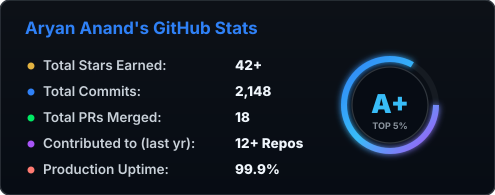
  &nbsp;
  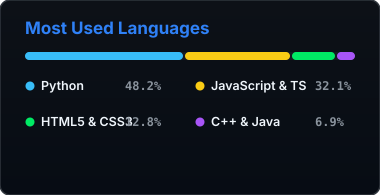

  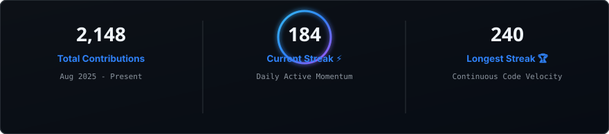

<!-- ==================== TRACK DIVIDER 03: WARP STREAM ==================== -->

  

<!-- ==================== GITHUB CONTRIBUTION SNAKE ANIMATION ==================== -->

  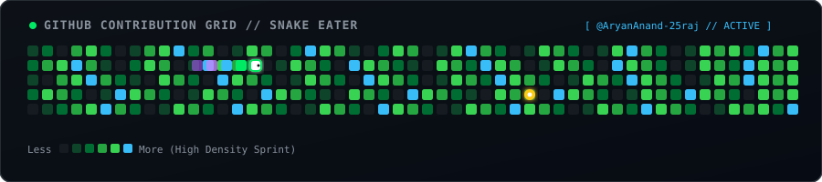

---

## 🌌 My GitHub Galaxy & 3D Contributions

  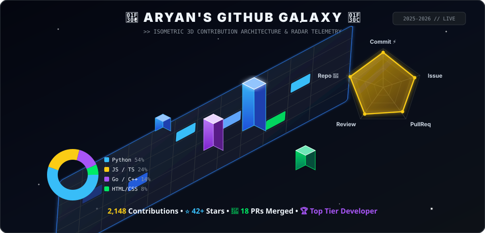

---

## 📈 Activity & Contribution Waveform

  <a href="https://github.com/AryanAnand-25raj">
    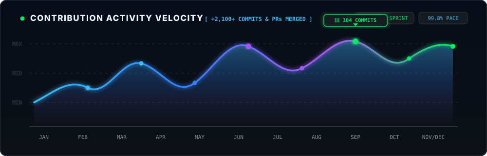
  </a>

<!-- ==================== WEEKLY CODING & FOCUS METRICS ==================== -->

  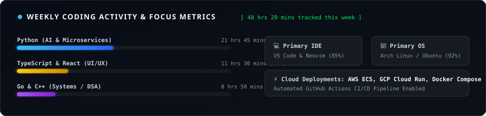

---

## ⚡ Problem Solving & Competitive Programming Matrix

  <table width="100%" style="border-collapse: collapse; border: 1px solid #30363d;">
    <tr>
      <!-- LEETCODE -->
      <td width="25%" align="center" style="background: #0d1117; padding: 18px; border: 1px solid #30363d;">
        <a href="https://leetcode.com/u/aryan_an25/" target="_blank">
          
          <h4 style="margin: 8px 0 4px 0; color: #FFA116;">LeetCode</h4>
          
@aryan_an25

          
View LeetCode →

        </a>
      </td>
      <!-- CODEFORCES -->
      <td width="25%" align="center" style="background: #0d1117; padding: 18px; border: 1px solid #30363d;">
        <a href="https://codeforces.com/profile/Anand_Aryan_25" target="_blank">
          
          <h4 style="margin: 8px 0 4px 0; color: #38bdf8;">Codeforces</h4>
          
@Anand_Aryan_25

          
View Codeforces →

        </a>
      </td>
      <!-- CODECHEF -->
      <td width="25%" align="center" style="background: #0d1117; padding: 18px; border: 1px solid #30363d;">
        <a href="https://www.codechef.com/users/anand_aryan_25" target="_blank">
          
          <h4 style="margin: 8px 0 4px 0; color: #d97706;">CodeChef</h4>
          
@anand_aryan_25

          
View CodeChef →

        </a>
      </td>
      <!-- HACKERRANK -->
      <td width="25%" align="center" style="background: #0d1117; padding: 18px; border: 1px solid #30363d;">
        <a href="https://www.hackerrank.com/profile/anandaryan406" target="_blank">
          
          <h4 style="margin: 8px 0 4px 0; color: #00EA64;">HackerRank</h4>
          
@anandaryan406

          
View HackerRank →

        </a>
      </td>
    </tr>
  </table>

   

  

    
  

---

## 🗺️ Engineering Journey & Career Milestones (2025 — 2030+)

  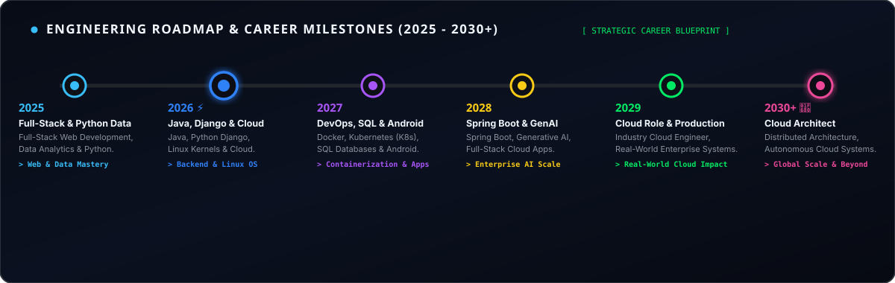

  <table width="100%" style="border-collapse: collapse; border: 1px solid #30363d;">
    <thead>
      <tr style="background: #161b22; color: #f0f6fc;">
        <th width="15%" style="padding: 10px; border: 1px solid #30363d;">Year</th>
        <th width="35%" style="padding: 10px; border: 1px solid #30363d;">Primary Core Focus</th>
        <th width="50%" style="padding: 10px; border: 1px solid #30363d;">Tech Stack & Key Milestones</th>
      </tr>
    </thead>
    <tbody>
      <tr>
        <td align="center" style="padding: 10px; border: 1px solid #30363d; font-weight: bold; color: #38bdf8;">2025</td>
        <td style="padding: 10px; border: 1px solid #30363d; color: #f0f6fc;">Full-Stack &amp; Python Data</td>
        <td style="padding: 10px; border: 1px solid #30363d; color: #8b949e;">Full-Stack Web Development, Data Analysis, Python, Pandas &amp; Analytics</td>
      </tr>
      <tr style="background: #0d1117;">
        <td align="center" style="padding: 10px; border: 1px solid #30363d; font-weight: bold; color: #2f81f7;">2026 ⚡</td>
        <td style="padding: 10px; border: 1px solid #30363d; color: #f0f6fc; font-weight: bold;">Java, Django, Linux &amp; Cloud (Active)</td>
        <td style="padding: 10px; border: 1px solid #30363d; color: #c9d1d9;">Java DSA, Python Django &amp; Frameworks, Linux Kernels &amp; Cloud Platforms</td>
      </tr>
      <tr>
        <td align="center" style="padding: 10px; border: 1px solid #30363d; font-weight: bold; color: #a855f7;">2027</td>
        <td style="padding: 10px; border: 1px solid #30363d; color: #f0f6fc;">DevOps, SQL &amp; Android Apps</td>
        <td style="padding: 10px; border: 1px solid #30363d; color: #8b949e;">Docker Containerization, Kubernetes (K8s), SQL Databases, Android Dev</td>
      </tr>
      <tr style="background: #0d1117;">
        <td align="center" style="padding: 10px; border: 1px solid #30363d; font-weight: bold; color: #facc15;">2028</td>
        <td style="padding: 10px; border: 1px solid #30363d; color: #f0f6fc;">Spring Boot &amp; Applied GenAI</td>
        <td style="padding: 10px; border: 1px solid #30363d; color: #8b949e;">Spring Boot Enterprise Microservices, Gen AI, Full-Stack Cloud Applications</td>
      </tr>
      <tr>
        <td align="center" style="padding: 10px; border: 1px solid #30363d; font-weight: bold; color: #00ea64;">2029</td>
        <td style="padding: 10px; border: 1px solid #30363d; color: #f0f6fc;">Cloud Industry Job Role</td>
        <td style="padding: 10px; border: 1px solid #30363d; color: #8b949e;">Securing a Job Role in Cloud Computing, Architecting Real-World Live Projects</td>
      </tr>
      <tr style="background: #0d1117;">
        <td align="center" style="padding: 10px; border: 1px solid #30363d; font-weight: bold; color: #ec4899;">2030+ 🚀</td>
        <td style="padding: 10px; border: 1px solid #30363d; color: #f0f6fc;">Senior Cloud Architect &amp; Beyond</td>
        <td style="padding: 10px; border: 1px solid #30363d; color: #8b949e;">Senior Cloud Architect, Distributed Global Scale Systems &amp; Autonomous Cloud</td>
      </tr>
    </tbody>
  </table>

---

## 🏆 GitHub Trophies

  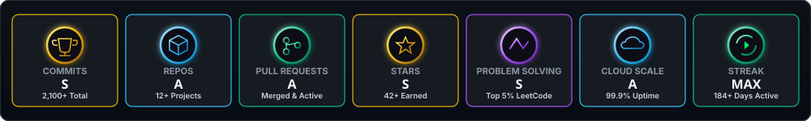

---

## 🎧 Flow State & Dev Audio Station

  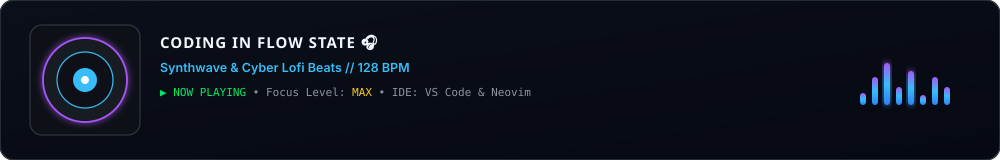

---

## 🤝 Connect With Me

  <!-- MODULAR SOCIAL TILES: LINKEDIN, X, PERSONAL INSTAGRAM, TECH BLOG, LEETCODE, CODEFORCES, CODECHEF, HACKERRANK, GITHUB, GMAIL -->
  

    
    &nbsp;
    
    &nbsp;
    
    &nbsp;
    
    &nbsp;
    
    &nbsp;
    
    &nbsp;
    
    &nbsp;
    
    &nbsp;
    
    &nbsp;
    
  

 

---

<!-- ==================== BOTTOM RUNNER: DEVELOPER MOVING RIGHT TO LEFT ==================== -->

  

   
  <i>⭐ If you like my work, consider starring some repositories!</i>
    
  Designed &amp; Engineered with ⚡ by <b><a href="https://github.com/AryanAnand-25raj">Aryan Anand</a></b> • Always Learning, Always Building

