<div align="center">

  <!-- ==================== HERO HEADER: DEVELOPER WORKSTATION ==================== -->
  <a href="https://github.com/AryanAnand-25raj">
    
  </a>

  <br/><br/>

  <!-- DYNAMIC TYPING SVG BANNER -->
  <a href="https://git.io/typing-svg">
    
  </a>

  <br/><br/>

  <!-- METRIC BADGES -->
  <p align="center">
    <a href="https://github.com/AryanAnand-25raj">
      
    </a>
    <a href="https://x.com/anand_aryan25" target="_blank">
      
    </a>
    
    
  </p>

</div>

<!-- ==================== TOP RUNNER: DEVELOPER MOVING LEFT TO RIGHT ==================== -->
<p align="center">
  
</p>

---

## 👨‍💻 Workstation & System Telemetry

<p align="center">
  
</p>

---

## 👨‍💻 About Me & Engineering Focus

```python
aryan = {
    "name":     "Aryan Anand",
    "location": "India 🇮🇳",
    "role":     "Software & Cloud Engineer",
    "learning": ["Cloud Computing", "DevOps", "Linux"],
    "skills":   ["Python", "ML", "Data Analytics", "Web Dev", "Java", "C++"],
    "reach_me": "anandaryan406@gmail.com",
    "fun_fact": "I am a Learner 🧑‍💻"
}
