<div align="center">

  <!-- ==================== HEADER: FUTURISTIC HYPERCAR ==================== -->
  <a href="https://github.com/aryananand-25raj">
    
  </a>

  <br/><br/>

  <!-- DYNAMIC STATUS & TELEMETRY BADGES -->
  <p align="center">
    
    
    
    
  </p>

  <!-- DYNAMIC TYPING SPEEDOMETER BANNER -->
  <a href="https://github.com/aryananand-25raj">
    
  </a>

</div>

<!-- ==================== TRACK DIVIDER 01: ACCELERATING DOWNWARD ==================== -->
<p align="center">
  
</p>

## 🛰️ // PILOT TELEMETRY & ABOUT ME

```python
aryan = {
    "name":     "Aryan Anand",
    "callsign": "Software & Cloud Engineer",
    "location": "India 🇮🇳",
    "engine":   "Python • ML • Cloud • DevOps • Linux",
    "learning": ["Cloud Computing", "DevOps", "Linux", "Java & DSA"],
    "skills":   ["Python", "ML", "Data Analytics", "Web Dev", "Java", "C++", "Docker"],
    "reach_me": "anandaryan406@gmail.com",
    "status":   "Always Learning, Always Building 🧑‍💻🏎️"
}
